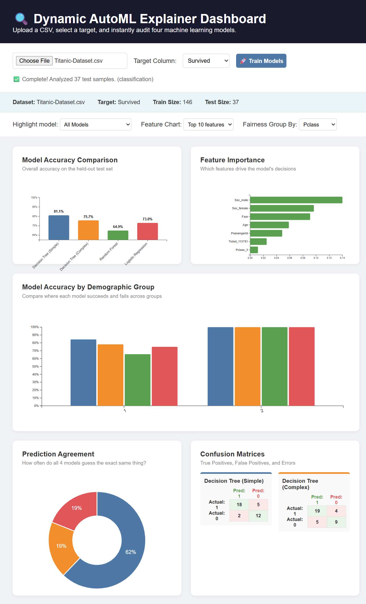
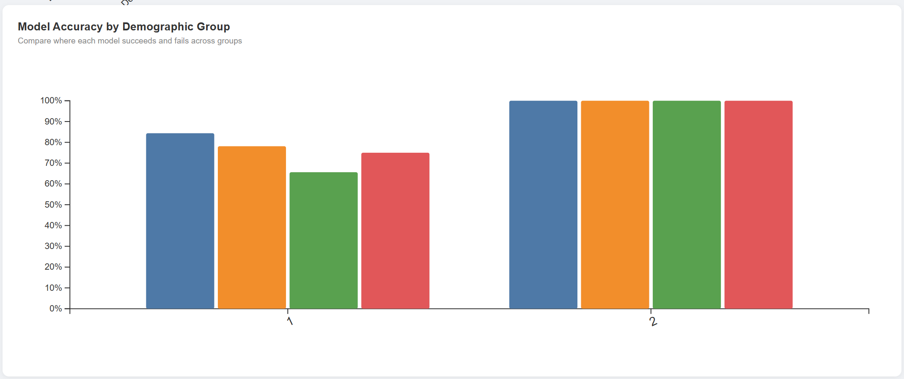
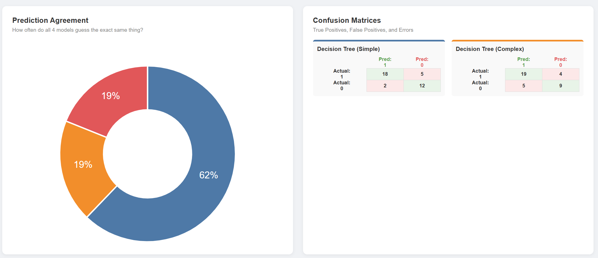
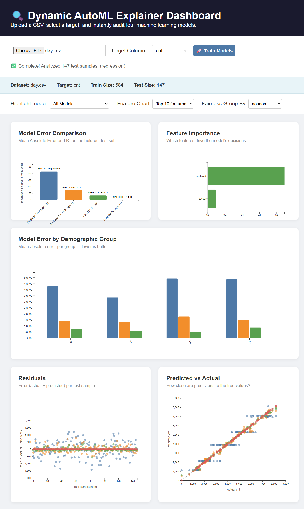
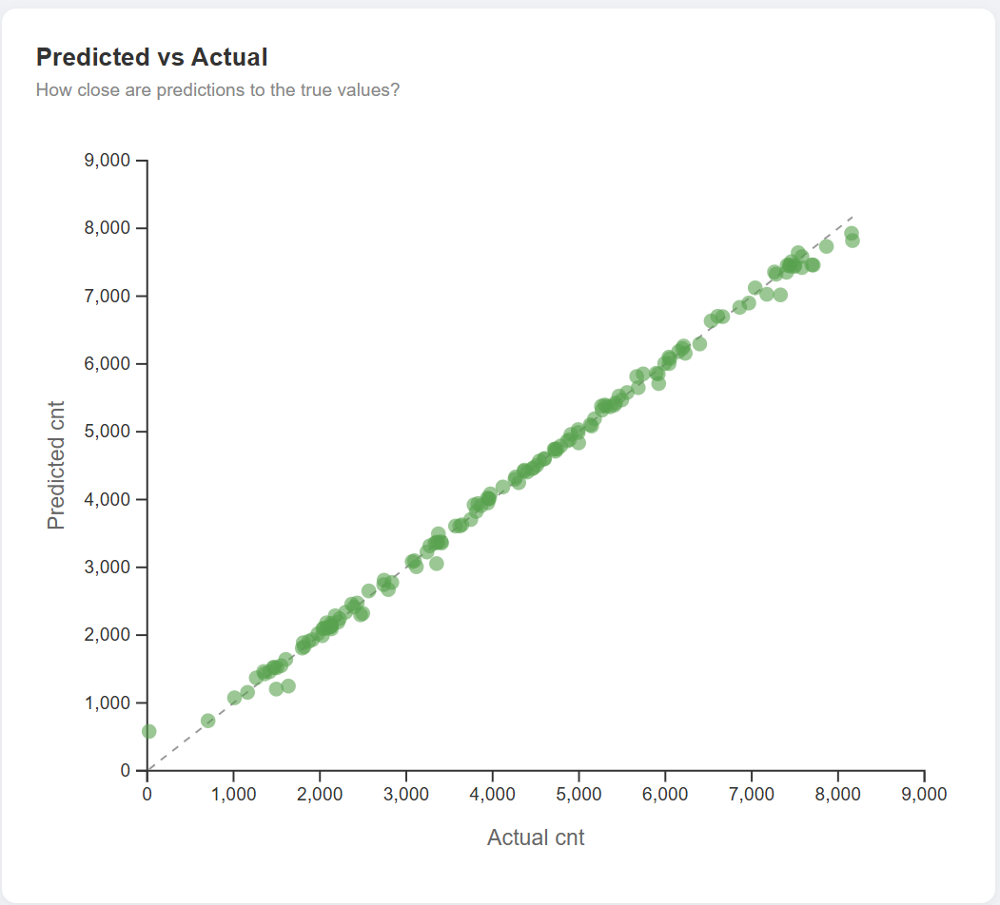
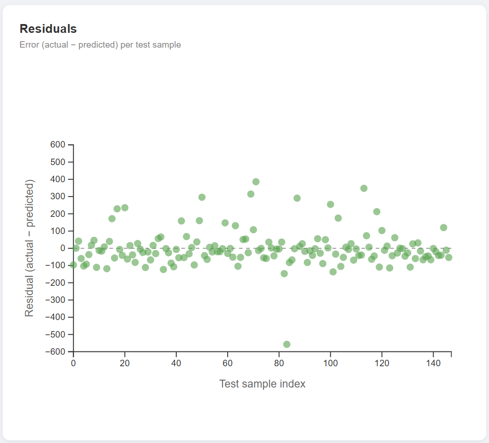

# Dynamic AutoML Explainer Dashboard
 
An interactive machine learning dashboard that **automatically detects** whether your dataset requires classification or regression, trains four models, and produces a full suite of diagnostic visualisations — all from a single CSV upload with no code required.
 
Built with Flask (Python backend) and D3.js (interactive frontend).
 
---
 
## Screenshots
 
### Classification Mode — Titanic Dataset
*The dashboard after uploading a classification dataset. Accuracy bars, feature importance, and demographic fairness analysis render automatically.*
 

 
*Demographic group accuracy breakdown — each bar group represents a passenger class (Pclass 1, 2, 3), showing where each model succeeds and fails across subgroups.*
 

 
*Prediction agreement donut (how often all four models agree) alongside per-model confusion matrices.*
 

 
### Regression Mode — Bike Sharing Dataset
*The dashboard auto-detects a continuous target and switches to regression mode — bars now show Mean Absolute Error (lower is better), with R² shown as labels.*
 

 
*Predicted vs Actual scatter plot per model. Points close to the dashed diagonal line indicate accurate predictions.*
 

 
*Residuals chart — error (actual − predicted) per test sample. A well-behaved model has residuals scattered evenly around zero.*
 

 
---
 
## Key Features
 
- **Automatic task detection** — uploads a CSV, selects a target column, and the backend detects whether the target is continuous (regression) or categorical (classification) based on its data type and number of unique values. No manual configuration required.
- **Four models trained simultaneously** — Decision Tree (Simple), Decision Tree (Complex), Random Forest, and Linear/Logistic Regression, selected automatically based on the task type.
- **Model Accuracy / Error Comparison** — bar chart comparing test-set accuracy (classification) or Mean Absolute Error and R² (regression) across all four models.
- **Feature Importance** — horizontal bar chart of the top N most influential features, drawn from tree-based models which expose `feature_importances_` directly.
- **Demographic / Subgroup Analysis** — grouped bar chart comparing each model's accuracy or error across subgroups of a user-selected categorical column, surfacing fairness gaps between groups.
- **Prediction Agreement** *(classification)* — donut chart showing how often all four models agree on the same prediction for a given test sample.
- **Confusion Matrices** *(classification)* — per-model true positive, false positive, true negative, false negative breakdown.
- **Predicted vs Actual Scatter** *(regression)* — one point per test sample per model; the dashed diagonal represents perfect prediction.
- **Residuals Plot** *(regression)* — error distribution per sample, with a zero-error reference line.
- **Interactive controls** — highlight a specific model, change the number of features shown, or switch the grouping variable; all charts redraw instantly.
---
 
## Project Structure
 
```
model-viz-dashboard/
├── app.py                  # Flask backend: task detection, model training, REST API
├── static/
│   └── dashboard.js        # D3.js chart logic and dashboard controller
├── templates/
│   └── index.html          # Dashboard UI
├── images/                 # Screenshots for this README
└── .venv/                  # Python virtual environment (not committed)
```
 
---
 
## Setup and Running
 
**1. Install dependencies**
```bash
pip install flask pandas scikit-learn
```
 
**2. Run the server**
```bash
python app.py
```
 
**3. Open the dashboard**
```
http://127.0.0.1:5000
```
 
---
 
## How It Works
 
### Backend (`app.py`)
 
1. **`/columns`** — reads the uploaded CSV and returns the column names so the user can select a target.
2. **`/upload`** — the main training endpoint:
   - Drops rows with missing values.
   - **Detects task type**: if the target column is numeric with more than 10 unique values, it is treated as a regression target; otherwise classification. This threshold is a deliberate design decision — it correctly identifies binary targets like `Survived` (2 unique values) as classification, and continuous targets like `SalePrice` (hundreds of unique values) as regression, while keeping the logic simple and auditable.
   - One-hot encodes categorical feature columns.
   - Splits data 80/20 (train/test, fixed seed for reproducibility).
   - Selects and trains the appropriate set of four models.
   - Computes accuracy (classification) or MAE and R² (regression) per model.
   - Extracts feature importances using `hasattr(model, 'feature_importances_')` — robust to both task types without hardcoding model names.
   - Returns everything as JSON: predictions per row, metrics, importances, task type, and groupable columns.
### Frontend (`dashboard.js`)
 
- Receives `task_type` from the backend JSON and branches all chart rendering accordingly.
- `updateCardLabels()` swaps card titles and subtitles to match the task type.
- `updateDashboard()` calls either the classification or regression chart set based on `currentTaskType`.
- All charts are redrawn from in-memory data when the user changes a dropdown — no additional server requests.
---
 
## Datasets for Testing
 
| Dataset | Task | Suggested Target Column | Source |
|---|---|---|---|
| Titanic | Classification | `Survived` | [Kaggle](https://www.kaggle.com/c/titanic) |
| Heart Disease | Classification | `target` | [UCI ML Repository](https://archive.ics.uci.edu/ml/datasets/heart+disease) |
| Iris | Classification | `species` | Built into sklearn |
| Bike Sharing | Regression | `cnt` | [UCI ML Repository](https://archive.ics.uci.edu/ml/datasets/bike+sharing+dataset) |
| California Housing | Regression | `median_house_value` | Built into sklearn |
 
---
 
## Known Limitations
 
- **Binary classification only** for confusion matrices and prediction agreement — multi-class targets will train correctly but the confusion matrix display uses only the first two classes.
- Rows with any missing values are dropped before training — datasets with extensive nulls will have a reduced effective sample size.
- Groupable columns are auto-detected as any feature with fewer than 10 unique values; for some datasets this may not surface the most meaningful grouping variable.
- The 10-unique-value threshold for task detection works well in practice but is a heuristic — a dataset with 9 genuinely ordinal categories would be misclassified as regression if stored as integers.
---
 
## Tech Stack
 
| Component | Technology |
|---|---|
| Backend | Python, Flask, pandas, scikit-learn |
| Frontend | D3.js v7, vanilla JavaScript, HTML/CSS |
| Models | scikit-learn classifiers and regressors |
 
---
 
## Potential Extensions
 
- Multi-class confusion matrix support.
- Per-sample prediction explanations using SHAP or LIME.
- Hyperparameter controls exposed in the UI.
- Confidence intervals on metrics to account for small test sets.
- Export charts as PNG or generate a PDF summary report.
